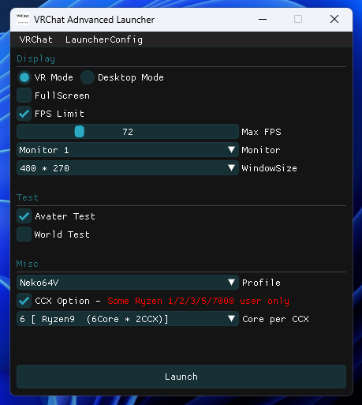
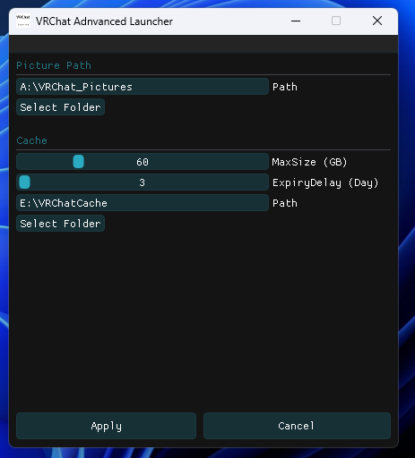

## 概要
VRChatの起動オプションをGUIベースで変更可能にしたちょっと便利なランチャー。  
いちいちSteamやショートカットを編集しなくても簡単に起動構成がいじれるのでいろいろ捗ります。<br>



## 機能について
GUIメニューの各機能について軽く説明します。
### Display
| 名前 | 機能 |
| ------- | ------ |
| VR/DesktopMode | VR or デスクトップモードで起動するか選択 |
| FullScreen | フルスクリーンで起動する |
| FPS Limit | FPSを制限する |
| Monitor | VRChatを表示するモニター。モニターのIDについてはWindowsの設定を参照 |
| WindowSize| ウィンドウのサイズを指定 |

### Test
| 名前 | 機能 |
| ------- | ------ |
| Avatar Test | ローカルテスト中のアバターがアップデートされた場合に自動で再度読み込みを行う。 |
| World Test | ローカルテスト中のワールドがアップデートされた場合に自動で再度読み込みを行う。 |

### Misc
| 名前 | 機能 |
| ------- | ------ |
| Profile | アカウントを切り替えることができる |
| CCX Option | 以下を参照 |

#### CCX Option
一部のRyzen CPUユーザー限定。  
CCX/CCDをまたいでの処理が行われなくなるのでレイテンシが減りパフォーマンスが向上する（らしい）

## メニューバー
| 名前 | 機能 |
| ------- | ------ |
| VRChat| %APPDATA%LocalLow内にあるVRChatのconfig.jsonをいじれる |
| LauncherConfig | %APPDATA%Local内にある |

## その他
### ランチャーの設定ファイル
config.json という名前で以下の場所にあります。  
また、このLauncherがPC上に残すファイルもこれだけです。
```
%AppData%Local/VRChatAdvancedLauncher
```